# Bazaar Helper

Bazaar Helper is a professional Android application designed for small business owners and daily traders to manage their financial records. It provides an efficient way to track daily sales, purchases, and calculate net profits or losses through a clean, localized interface.

## Features

*   **Smart Dashboard:** Real-time summary of today's sales, purchases, and net profit with a clear empty state.
*   **Daily Tracking:** Easily record or edit daily financial entries with automatic profit calculation.
*   **Visual Analytics:** Detailed monthly reports with interactive bar charts for better financial insights.
*   **Professional Reporting:** Generate and share professional monthly PDF reports in both languages.
*   **Records History:** Browse, search by date, and manage historical records efficiently.
*   **Data Management:** Robust export/import system for database backups to ensure data safety.
*   **Security:** Integrated biometric authentication (Fingerprint/Face ID) for maximum data privacy.
*   **Offline First:** Reliable local data storage using Room DB, ensuring availability without internet.
*   **Multi-language Support:** Seamlessly switch between English and Arabic with full RTL support.

## Technical Stack

*   **Language:** Kotlin
*   **UI Framework:** Jetpack Compose (Material 3)
*   **Dependency Injection:** Hilt
*   **Database:** Room Persistence Library
*   **Architecture:** MVVM (Model-View-ViewModel)
*   **Navigation:** Jetpack Compose Navigation
*   **Security:** Android Biometric API
*   **Reporting:** Android PDF Document API

## Screenshots

### English Version
| Home (Empty) | Home (Summary) | Add Record |
|:---:|:---:|:---:|
| 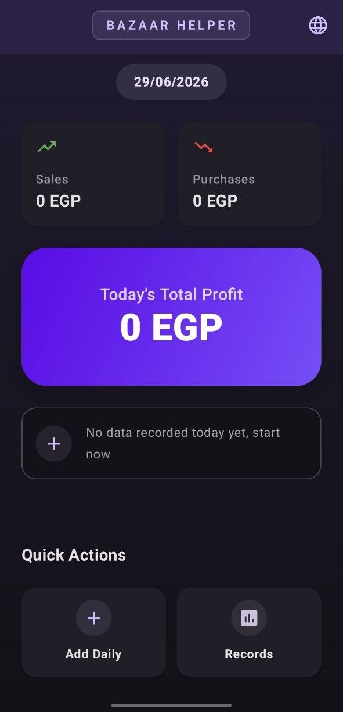 | 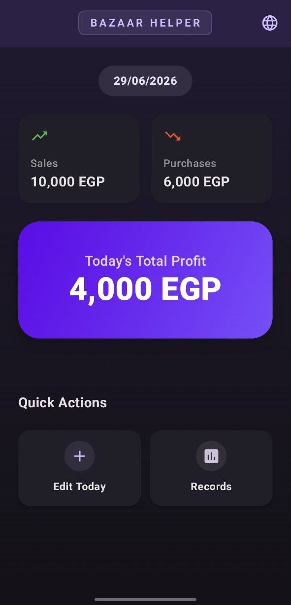 | 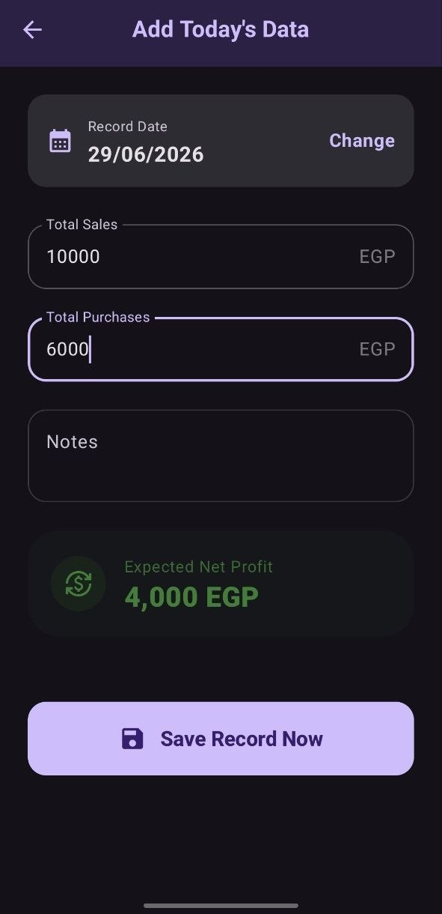 |

| Records List | Backup & Restore | Monthly Summary |
|:---:|:---:|:---:|
| 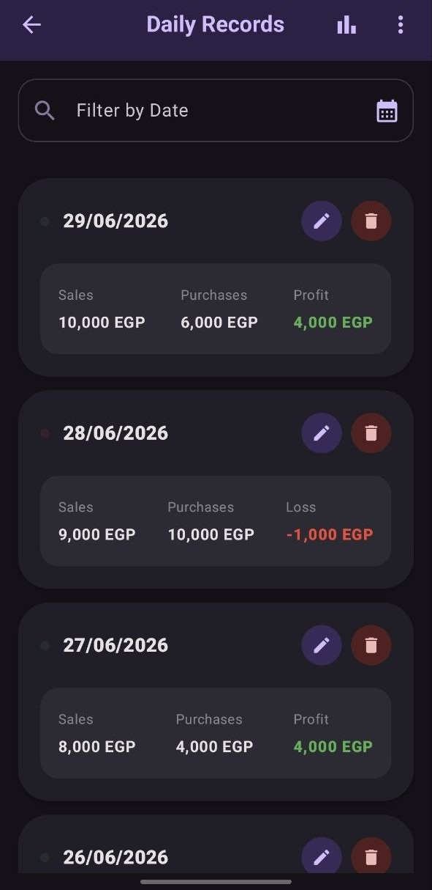 | 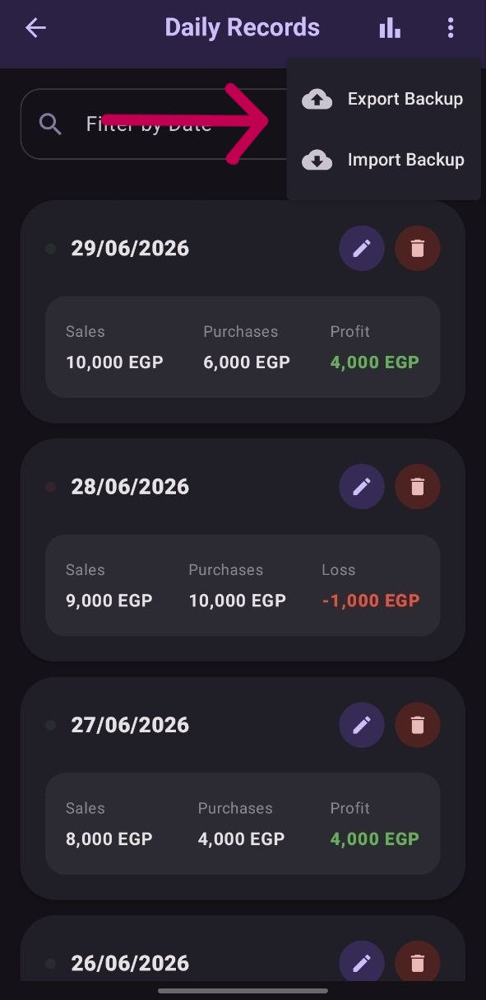 | 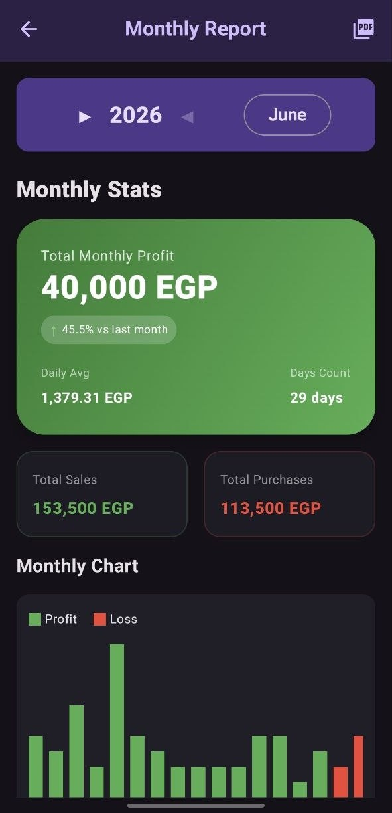 |

| Monthly Analytics | PDF Report |
|:---:|:---:|
| 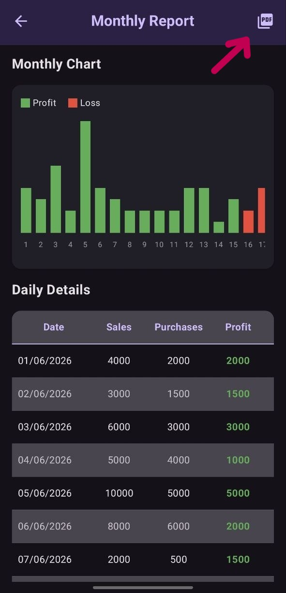 | 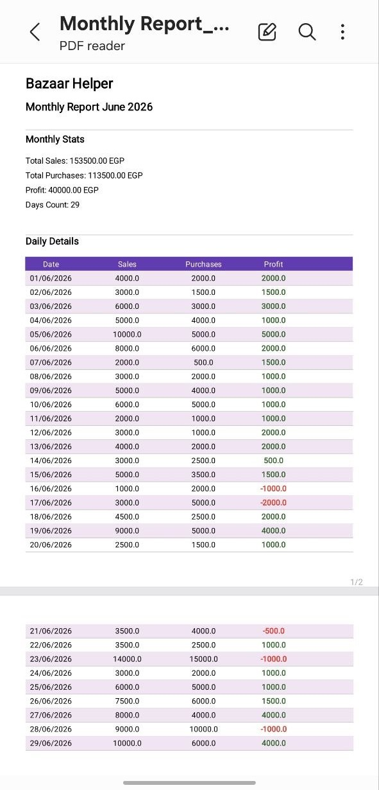 |

### Arabic Version (العربية)
| الرئيسية (فارغة) | الرئيسية (بيانات) | إضافة سجل |
|:---:|:---:|:---:|
|  |  |  |

| قائمة السجلات | النسخ الاحتياطي | ملخص الشهر |
|:---:|:---:|:---:|
| 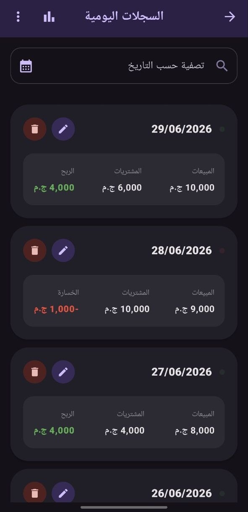 | 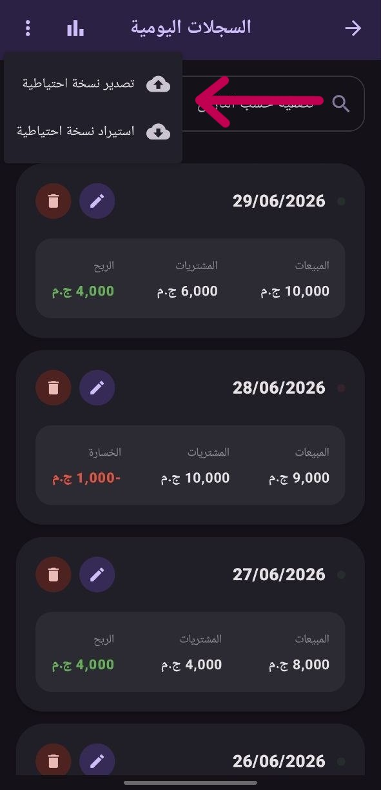 | 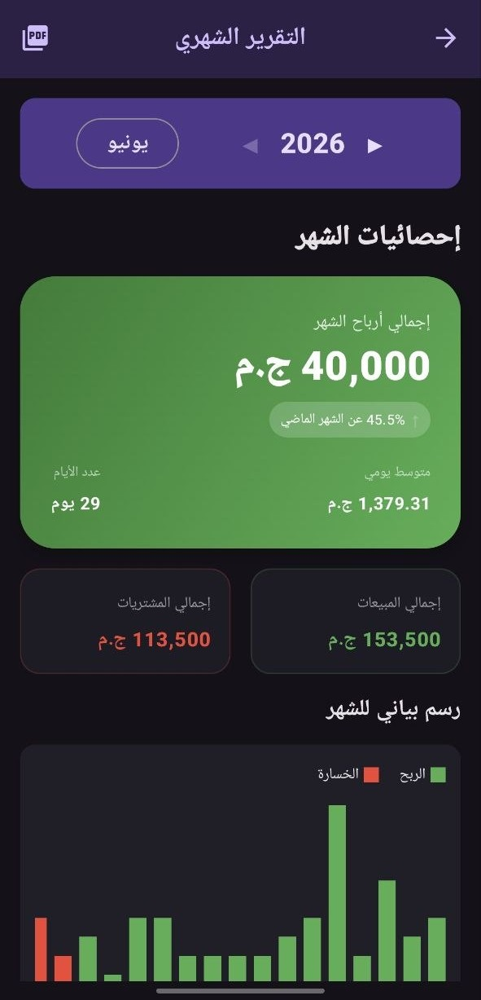 |

| تحليلات الشهر | تقرير PDF |
|:---:|:---:|
| 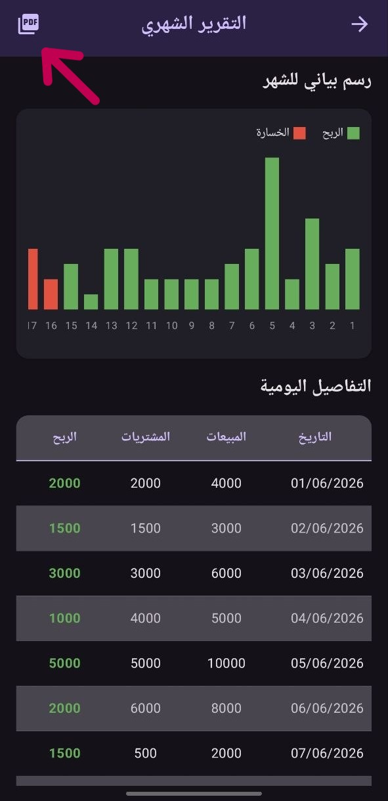 | 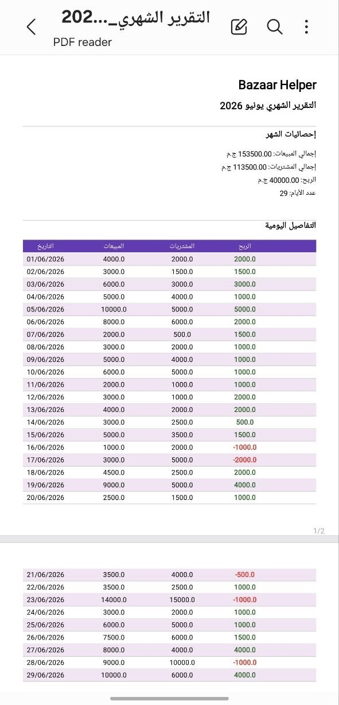 |

## Installation

1.  **Clone the repository:**
    ```bash
    git clone https://github.com/youssefhany2000/Bazaar-Helper.git
    ```
2.  **Open in Android Studio:**
    *   Navigate to File > Open and select the `Bazaar-Helper` folder.
3.  **Sync Gradle:**
    *   Allow Android Studio to download and configure the necessary dependencies.
4.  **Run the Application:**
    *   Connect an emulator or a physical device and execute the Run command.

---
Developed by [Youssef Hany](https://github.com/youssefhany2000)
